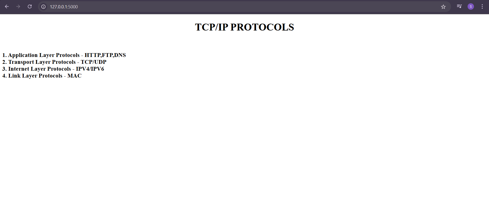

# EX01 Developing a Simple Webserver
## Date:
10/04/2025

## AIM:
To develop a simple webserver to serve html pages and display the list of protocols in TCP/IP Protocol Suite.

## DESIGN STEPS:
### Step 1: 
HTML content creation.

### Step 2:
Design of webserver workflow.

### Step 3:
Implementation using Python code.

### Step 4:
Import the necessary modules.

### Step 5:
Define a custom request handler.

### Step 6:
Start an HTTP server on a specific port.

### Step 7:
Run the Python script to serve web pages.

### Step 8:
Serve the HTML pages.

### Step 9:
Start the server script and check for errors.

### Step 10:
Open a browser and navigate to http://127.0.0.1:8000 (or the assigned port).

## PROGRAM:
~~~
from http.server import HTTPServer,BaseHTTPRequestHandler

content="""
<!doctype html>
<html>
<head>
<title> My Web Server</title>
</head>
<body>

<h1>TCP/IP PROTOCOLS</h1> 

<h3>
1. Application Layer Protocols - HTTP,FTP,DNS 
2. Transport Layer Protocols - TCP/UDP 
3. Internet Layer Protocols - IPV4/IPV6 
4. Link Layer Protocols - MAC 
</body>
</html>
"""

class MyServer(BaseHTTPRequestHandler):
    def do_GET(self):
        print("Get request received...")
        self.send_response(200) 
        self.send_header("content-type", "text/html")       
        self.end_headers()
        self.wfile.write(content.encode())

print("This is my webserver") 
server_address =('',5000)
httpd = HTTPServer(server_address,MyServer)
httpd.serve_forever()
~~~

## OUTPUT:

## RESULT:
The program for implementing simple webserver is executed successfully.
